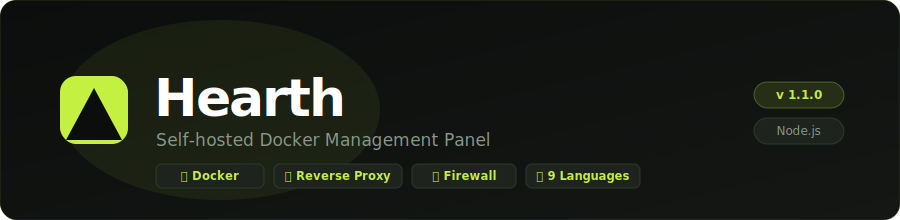

<div align="center">
  
</div>

<div align="center">

[](LICENSE)
[](https://nodejs.org)
[](https://docker.com)

**Read in:** &nbsp; 🇬🇧 English &nbsp;|&nbsp; [🇩🇪 Deutsch](README.de.md)

</div>

---

Hearth is a lightweight, self-hosted Docker management panel — a clean, modern alternative to CasaOS or Portainer for home servers and small VPS setups.

## ✨ Features

| | |
|---|---|
| 🐳 **Container Management** | Start, stop, restart, delete, view logs, edit ports/volumes/env |
| 🔀 **Reverse Proxy** | Built-in Nginx — route domains to containers, SSL/Let's Encrypt, WebSocket |
| 🛡 **Firewall** | UFW-based — rate limiting, rule ordering, live logs, outbound rules |
| 🔒 **VPN** | WireGuard integration — manage peers, generate QR codes |
| 📁 **File Manager** | Upload, download, rename, delete — locked to a safe directory |
| 🌐 **Guest View** | Public page showing your running services — no login required |
| 📦 **App Store** | 1-click install for 20+ popular self-hosted apps |
| 📊 **Monitoring** | Live CPU, RAM, network, storage, temperatures |
| 🔁 **Self-Update** | Built-in updater with live log stream — see every step as it happens |
| 🔔 **Notifications** | Update alerts and system events in the topbar |
| 🌍 **9 Languages** | DE · EN · RO · FR · ES · IT · PL · NL · PT |

---

## 🚀 Installation

### One-Line Install (Recommended)

```bash
curl -fsSL https://raw.githubusercontent.com/MarioundMB/Hearth/main/install.sh | bash
```

> **Alternative — wget:**
> ```bash
> wget -O - https://raw.githubusercontent.com/MarioundMB/Hearth/main/install.sh | bash
> ```
>
> **Alternative — if your shell doesn't give the script a real terminal for prompts (e.g. some `ssh host '...'` invocations):**
> ```bash
> bash -c "$(curl -fsSL https://raw.githubusercontent.com/MarioundMB/Hearth/main/install.sh)"
> ```

The installer automatically:
- Installs **Docker**, **Docker Compose** and **Git** if needed
- Generates a secure session secret
- Creates data directories
- Builds and starts Hearth

After installation, open **`http://<server-ip>:4500`** — a setup wizard guides you through the initial configuration.

> ℹ️ The same command also **updates** an existing installation without touching your `.env`.

### Manual Installation

```bash
git clone https://github.com/MarioundMB/Hearth.git
cd Hearth
cp .env.example .env
# Edit .env and set SESSION_SECRET (generate with: openssl rand -hex 32)
docker compose up -d --build
```

---

## ⚙️ Configuration

All settings are in `.env` (created by the installer):

| Variable | Default | Description |
|---|---|---|
| `PORT` | `4500` | Admin UI port |
| `GUEST_PORT` | `3000` | Public guest view port |
| `PROXY_PORT` | `443` | Reverse proxy HTTPS port |
| `DATA_DIR` | `/srv/hearth-data` | File manager root directory |
| `SESSION_SECRET` | — | Required — random string for secure sessions |

Additional settings (server name, language, auto-refresh, Cloudflare, nightly auto-update, etc.) are available in the admin panel under **⚙ Settings**.

---

## 🔀 Reverse Proxy

Hearth includes a built-in Nginx reverse proxy with full SSL support:

- Route domains to containers via the **Reverse Proxy** tab
- **SSL certificates** — auto-generated self-signed, Let's Encrypt (HTTP-01 or Cloudflare DNS-01), or custom upload
- **Basic Auth** and **IP allowlist/denylist** per rule
- **Security headers**, static asset caching, custom nginx snippets
- **Traffic logs** with status code breakdown
- Full WebSocket support

---

## 🛡 Firewall

Manage UFW rules from the admin panel:

- **Rate limiting** — block brute-force with `ufw limit` (>6 connections/30s)
- **Drag & drop** rule ordering — first-match-wins, fully controllable
- **Live log stream** — see blocked/allowed connections in real time
- Outbound rules and interface binding (e.g. `wg0` for VPN-only rules)

> Requires the `hearth-firewall` helper container (included in `docker-compose.yml`).

---

## 🔁 Self-Update

Click **Update** in ⚙ Settings to update Hearth in place. A live log modal shows each step:

1. Branch validation — falls back to `main` automatically if the configured branch no longer exists
2. `git fetch` + code reset to the latest commit
3. Docker rebuild and container restart
4. Page reloads automatically once the new version is live

Build cache and dangling images are cleaned up automatically after each update.

**Manual update** (e.g. when the panel itself is unreachable):
```bash
cd ~/hearth && git fetch origin && git reset --hard origin/main && docker compose up -d --build hearth
```

---

## 🏷️ Guest View Labels

Control how containers appear on the public guest page:

| Label | Effect |
|---|---|
| `hearth.name` | Display name |
| `hearth.icon` | Emoji or image URL |
| `hearth.port` | Which port is the web UI |
| `hearth.scheme` | `http` (default) or `https` |
| `hearth.url` | Override the auto-detected URL |
| `hearth.hide=true` | Hide from guest **and** admin view |

**Example:**
```yaml
labels:
  - "hearth.name=Jellyfin"
  - "hearth.icon=🎬"
  - "hearth.port=8096"
```

---

## 🔒 Security Notes

- The **setup wizard** prevents running with default credentials
- Docker socket access grants root-equivalent privileges — only use on trusted networks
- For public internet access, place Hearth behind a reverse proxy with HTTPS (or use the built-in proxy with a real domain)
- The **file manager** is locked to `DATA_DIR` — path traversal is blocked server-side

---

## 🏗️ Tech Stack

- **Backend:** Node.js · Express · Dockerode · Nginx
- **Frontend:** Vanilla HTML / CSS / JS — no build step, no frameworks
- **Auth:** Session cookies (`express-session`) · bcrypt password hashing

```
hearth/
├── server.js              # Backend — all API routes
├── Dockerfile
├── docker-compose.yml
├── nginx/nginx.conf       # Nginx base config
├── install.sh             # One-line installer
└── public/
    ├── admin.html         # Admin panel
    ├── index.html         # Guest view
    ├── login.html / setup.html
    ├── css/style.css
    └── js/
        ├── admin.js · guest.js · common.js
        └── i18n.js        # 9 languages
```

---

## 🔄 Stop / Restart

```bash
# Stop
cd ~/hearth && docker compose down

# Restart
cd ~/hearth && docker compose up -d
```

---

<div align="center">
  <sub>Built with ❤️ for home servers · <a href="https://github.com/MarioundMB/Hearth/issues">Report an issue</a></sub>
</div>
