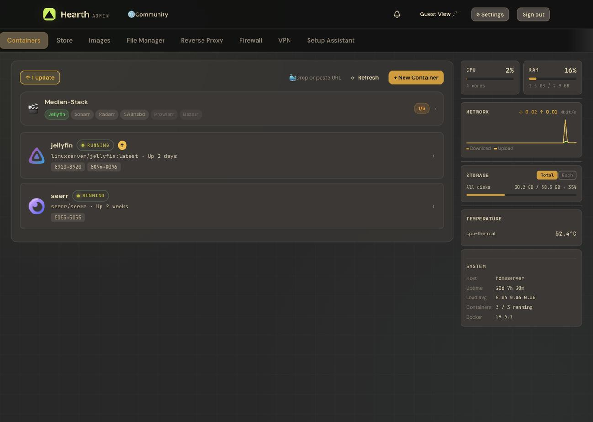
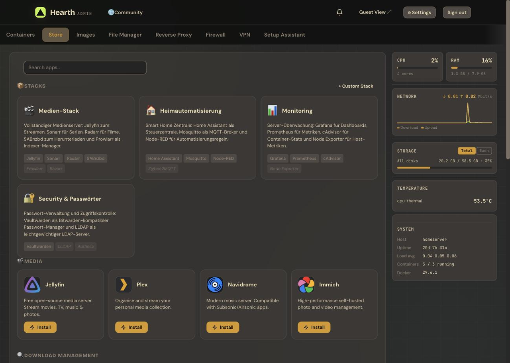
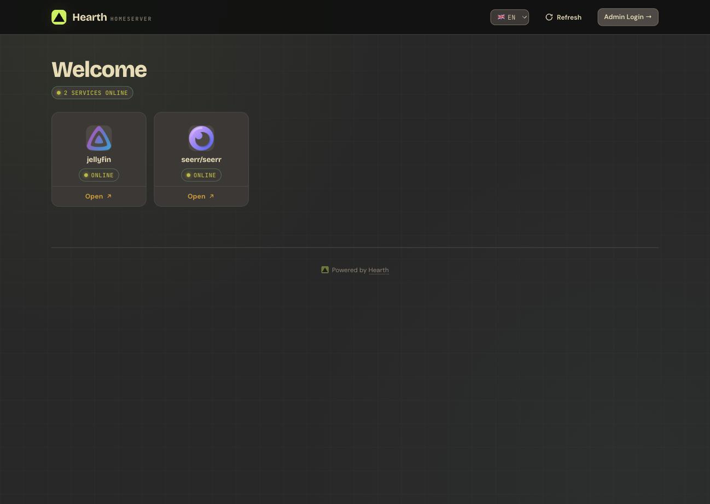
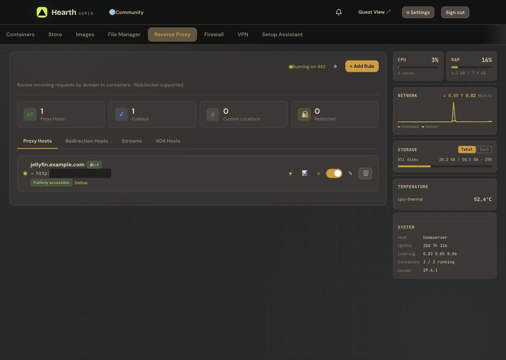
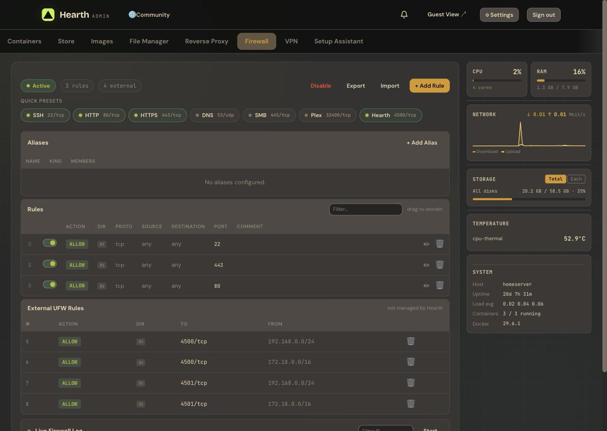
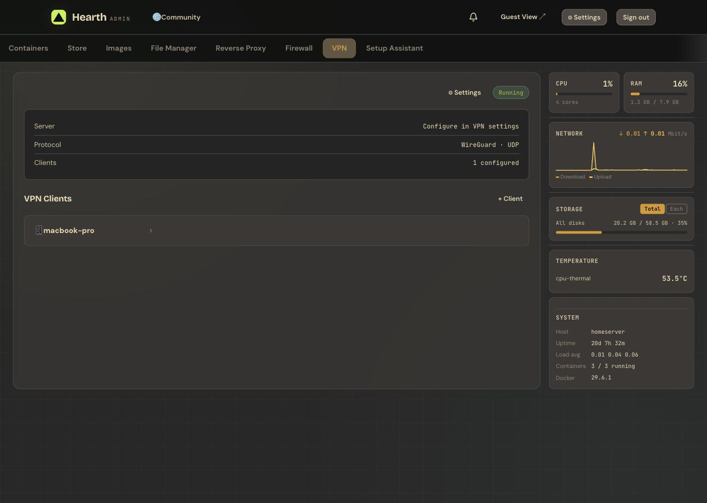

# Getting Started with Hearth

This tutorial walks you from a fresh server to your first running app — in about 10 minutes.

**You'll need:** a Linux server (home server, Raspberry Pi or small VPS) with a sudo-capable user. Docker is installed automatically if missing.

---

## 1. Install Hearth

Run the one-line installer on your server:

```bash
curl -fsSL https://raw.githubusercontent.com/MarioundMB/Hearth/main/install.sh | bash
```

The installer takes care of everything: it installs **Docker**, **Docker Compose** and **Git** if needed, generates a secure session secret, creates the data directories, and builds and starts Hearth.

When it finishes, it prints the address of your new panel.

## 2. Run the setup wizard

Open **`http://<server-ip>:4500`** in your browser.

On first start, a short setup wizard guides you through the initial configuration — you create your admin account (username + password) here. Passwords are stored bcrypt-hashed; you can add 2FA or passkeys later under **⚙ Settings → Security**.

## 3. Meet the dashboard

After logging in you land on the **Containers** tab:

<p align="center"></p>

- The main list shows your **containers and stacks** — start, stop, restart, view logs or edit ports, volumes and environment variables per container. An arrow badge appears when an image update is available.
- The sidebar on the right shows **live system monitoring**: CPU, RAM, network, storage and temperatures.

A fresh install has no containers yet — let's fix that.

## 4. Install your first app

Switch to the **Store** tab:

<p align="center"></p>

The App Store offers 20+ popular self-hosted apps in categories, plus **curated stacks** that install several apps that work well together (e.g. a complete media server) in one go.

1. Use the search field or browse a category.
2. Click **Install** on an app — for example **Jellyfin**.
3. Hearth pulls the image, creates the container with sensible defaults and starts it.

Back on the **Containers** tab you'll see your new app running. Click the port badge (e.g. `8096→8096`) to open the app itself.

## 5. Share it — the Guest View

Hearth serves a public, login-free status page on port **3000**:

<p align="center"></p>

Open **`http://<server-ip>:3000`** — everyone in your network can see which services are online and open them with one click. Which containers appear here is controlled via labels (see [Guest View Labels](../README.md#-guest-view-labels)).

## 6. Where to go next

- **Reverse Proxy** — route real domains to your containers with Let's Encrypt SSL, right from the **Reverse Proxy** tab.

  <p align="center"></p>

- **Firewall** — manage UFW rules with quick presets for common services on the **Firewall** tab.

  <p align="center"></p>

- **VPN** — add WireGuard clients and scan the QR code with your phone on the **VPN** tab.

  <p align="center"></p>

- **Self-Update** — keep Hearth current with one click under **⚙ Settings → Updates** (or enable nightly auto-updates).

Questions or ideas? Open an [issue](https://github.com/MarioundMB/Hearth/issues) — feedback is welcome!
